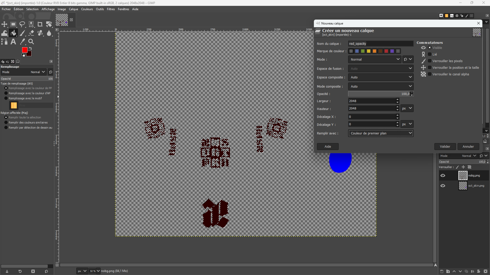

# Designer Guide

## Introduction

Rocket League Designer doesn't provide an integrated designer, so you will have to use an external image editor like GIMP or Photoshop to create your decals. Also if you want to using a 3D software like Blender to create your decals is highly recommended, as it will allow you to see how your decal will look like in the game, and also to create more complex decals with 3D models.
This guide will help you understand how to create decals and how to use them in Rocket League Designer.

## Requirements

- 2D image editor (GIMP, Photoshop, etc.)
- 3D software (Blender, etc.) - optional but recommended
- Basic knowledge of image editing and 3D modeling

In this guide, we will focus on GIMP as the 2D image editor and Blender as the 3D software, but you can use any other software that you are comfortable with.

## Before You Start

Here are some video tutorials that I recommend watching if this tutorial is not enough for you:
- [HOW TO: Blender set up for Rocket League cars | Custom Decals](https://www.youtube.com/watch?v=kqnoKMSz9yM)

Also you can find a lot of in game decals and models here : [https://npc.nepmia.fr/s/dMYfWrK6pXGMaXk](https://npc.nepmia.fr/s/dMYfWrK6pXGMaXk)

If some of the models are missing, here is the tutorial to extract them from the game files and converting it to an .obj file: [https://www.youtube.com/watch?v=RdgA_RMLDeU](https://www.youtube.com/watch?v=RdgA_RMLDeU)

⚠️I still highly recommend to use the models from the game files, as they are more accurate and up to date. This will avoid any issues with the models that are not matching the game (as I got this issue...).

## Preparing the model in Blender

Before you start creating your decal, you need to prepare the model in Blender. This will allow you to see how your decal will look like on the car and also to create more complex decals with 3D models.

Let's start by either downloading a model or extracting it from the game files (the links are available in the ["Before You Start"](#before-you-start) section). Note : If you extracted the model from the game files, you will most likely already have two materials for the car, one for the body and the other one for the chassis. You can find in the ["Tips"](#tips) section how to split the model into two parts as it will be easier to create the decal for each part separately.

Now open Blender and remove the default cube by selecting it and pressing `X` to delete it. Then import the model you downloaded or extracted by going to `File` > `Import` > `Wavefront (.obj)` and selecting the model file.

Here you can either import the body, chassis, both or even another part of the car if available. For this tutorial, we will focus on the Body of the car, but the same principles apply to the rest.

However when importing for the first time, you might notice that the model is not properly oriented or scaled (but apparently this is not the case for every model). 
To fix this, first go in the "Object" tab, and select the "Transform" section. Here you can reset the rotation of the model. For the scale you can use the "S" key to scale the model to the desired size. (I recommend scaling it down util you see the camera and lights appearing in the viewport)

Now there is something very important to check before starting to create your decal (maybe you will be able to notice it once you start painting on the car and this is really something important to check). You absolutely need to check that the car UV map is oriented properly, e.g. if you paint on a right side it should appear to be the right side for the UV map. If this is not the case there is a fix for this : You have to set you X scale to a negative value (- `your_value`) and set the Z rotation to 180 degrees. This will flip the UV map and make it oriented properly. 

.

Now at this point you should not have any UV map yet, and any way to paint on the car. So let's create this.

For the UV map, you can go in the "UV Editing" tab.

Go in "Edit Mode" and press `A` to select all the vertices.

Then press `alt` + `N` and then select "Recalculate Outside" to recalculate the UV map. This will ensure that the UV map is properly oriented and that you can paint on the car.

Then in the "Data" tab, go in "Geometry Data" and click on "Clear custom split normals data". This will ensure that the normals are properly oriented and that you can paint on the car.

Now in the "Texture Paint" tab, add a new image and set the size to 2048x2048.

This should make your texture appear in the UV map.

Now go in the "Shading" panel and create a new material for the car. 

Next add an "Image Texture (Color)" node and link it to the "Base Color" of the "Principled BSDF" node. Then select the image you just created in the "Image Texture (Color)" node.

At this point you should check if the UV map is properly oriented. If this is not the case, you can go back in the "UV Editing" tab and adjust the UV map to make sure it is properly oriented. By redoing some of the steps above.

At this point we only have a single Texture, but I recommend to have a second texture. One will be for the background (in order to better see the decal), and the other one will be for the decal itself.

For this in the "Shading" panel, add a "Mix (Mix)" node. Link your "background" texture to A, and create a new "Image Texture (Color)" node for the decal and link it to B. Then link the "Mix (Mix)" node to the "Base Color" of the "Principled BSDF" node. Add a new Image for the newly added "Image Texture (Color)" node and set the size to 2048x2048.

Now for your decal texture, I recommend to completely remove the background and make it transparent, by using the "Erase Alpha" mode in the "Texture Paint" tab. This will allow you to see the decal on the car without any background.

Now you can save this blender project so you can easily come back to it later and use it as a template for your decals.

## Creating a Decal

Multiple layers are used in Rocket League decals, and each layer has a specific purpose. The main layers are:

- **Skin** - This layer determines how the colors should be displayed on the decal (for example, team color, windows, etc.).
- **Diffuse** - This layer contains the main design of the decal, which will be applied to the car. For example the image of the decal itself.

Those layers are used for both the chassis and the Body of the car. On this tutorial we will focus on the Body of the car, but the same principles apply to the chassis.

For a better quality, I recommend using 2048x2048 images for the diffuse and skin layers.

Warning: The skin image determines how the colors should be displayed on the decal, so it is important to make sure that the skin matches the diffuse image properly so the image you want to display will appear correctly on the car.

You can find any of my template at [https://github.com/ALXS-GitHub/RL-Designer/tree/main/decals/templates](https://github.com/ALXS-GitHub/RL-Designer/tree/main/decals/templates) for the 3D models and [https://github.com/ALXS-GitHub/RL-Designer/tree/main/decals/decals/Templates](https://github.com/ALXS-GitHub/RL-Designer/tree/main/decals/decals/Templates) for the images. You can use them as a starting point for your decals.

### Preparing the Decal

Before you start creating your decal, you need to prepare the images that will be used for the diffuse and skin layers.

First of all, download any image you want and we are going to prepare it by removing the background and making it transparent.

On you image editor, you need to make sure that the image allow the transparency by adding an alpha channel to the image. In GIMP, you can do this by going to `Layer` > `Transparency` > `Add Alpha Channel`. 

Now select the select by color tool and select the background color you want to remove. (You can also use the magic wand tool if you prefer). You can either select the background by color, or by alpha channel. Here we are going to select the background, using a low threshold to select only pixels that are similar to the background color. Then enter "Delete" to remove the background.

Extra tip : In the "Select" menu, you can use the "Grow" or "Shrink" options to adjust the selection area if needed. This can help you to avoid leaving any unwanted pixels around the edges of your decal. Also if some pixels are selected but inside the decal, you can use a technique called "Morphological Closing" that consist of first shrinking the selection by a few pixels, then growing it back to the original size. This will help you to remove any unwanted holes.

Then you can save the image as a PNG file to preserve the transparency. In GIMP, you can do this by going to `File` > `Export As...` and selecting PNG as the file format. (Note : you can see that there is an option to save the alpha channel colors, it is not needed in this step, but later in the process we will need to use it).

Perfect! Now you can make the same for all the images you want to use in your decal and you are ready to start creating your decal.

### Diffuse Image

Let's start with the diffuse image, which is the main design of the decal. This image will be applied to the car's body. 
Why starting with the diffuse image? Because it is the most important part of the decal, and it will be used to create the skin image later on (for example just filling the skin image on the areas where the diffuse image is applied).

Let's start creating the sticker in Blender. Here you will have to load the car body's model, and create a new material for the decal. 

I recommend using a template decal image with a with a monochrome color (like green as it will act as a green screen when we will extract the skin image later on) so you can easily see the areas where the decal will be applied.
Make sure this template decal is another layer than your main decal image so you can easily extract the decal part when saving the diffuse image. Here in this example you can see that we are using two layers: one for the background (Undefined) and the other one for the decal itself (Image)

In order to have the two layers shown at the same time when editing, I recommend using the "Material Preview", mode for the Viewport Shading, and if the lighting feels weird or too dark, you can click on the down arrow next to it, and modify the scene elements to your liking.

Please, when you start editing, don't forget to switch to the proper UV map, so you don't edit the background UV map by mistake.

You can then start painting colors with the brush tool any way you want. 

However what interests us the most in this tutorial is how to apply images on the decal.

First you need to create a new texture. For this go in the "Texture" tab, and click on the "New" button. Then you can select the image you want to use as a texture (open folder and select your image).

Now In the "Tool" tab, go in the "Texture" section, select the texture you just created, and make sure you are using the mapping to "Stencil", this will allow you to use the image as a mask for the decal. You can move around the stencil using the `right mouse button`, rotate it by pressing `ctrl + right mouse button`, and scale it by pressing `shift + right mouse button`. Also don't forget to reset the "Image Aspect" so the image is not stretched weirdly.

Now when applying the texture, make sure that you are using `#FFFFFF` (white) as the color, and `Mix` as the blend mode. This will allow you to apply the texture on the decal.

Once finished, you can save the diffuse image by going to `Image` > `Save` and selecting PNG as the file format. Make sure to save it in the same folder as the template decal image so you can easily find it later. When saving, I recommend using a name similar to `<car_name|sticker_name>_diffuse.png` (for example `oct_diffuse.png`), so you can easily identify it later. (If you do this with the chassis, you can use `<car_name|sticker_name>_chassis_diffuse.png`).

Note : If you also save your blender project at this point, it will automatically use the saved diffuse image as the texture for the decal, so you can easily see how it looks on the car.

One last thing I would highly recommend is to keep a copy of the diffuse image and name it something like "no background" version as the final diffuse image will have a black background but this could be annoying when we are going to use our diffuse image as a template for the skin image.

The final step is the fill the background of the diffuse image in black in the 2D image editor (make sure you have your no background copy saved before doing this) : 

Last tip, since blender still paint some lower alpha pixels, I recommend to directly go in your 2D image editor and select the decal part of the diffuse image and fill it with the 100% opaque color you want to use for the decal. To do this, right click the layer, then add a new layer mask with "Transfer Alpha Channel" option. Then bucket fill the mask with white color, and finally right click the layer again and select "Apply Layer Mask". This will ensure that the decal is fully opaque and ready to be used in Rocket League Designer.
There is an alternative way to do this in Blender : Select the "add alpha" paint mode and paint all the decal with white color. This will ensure that the decal is fully opaque, but it will make a black background. You can finally remove this black background by selecting the background color and deleting it in your 2D image editor.

Even thought those approaches work, there is still a better way to make sure every pixel is fully opaque directly in Blender.

First make sure to use Falloff -> Constant in the Brush panel. 

Then create a copy of you texture and enable the "Color Ramp" option with mode "Constant" (!! Very important !!) (Please don't forget to set to "Constant" Too). Now you can set the first trigger to black (or white) with 0% alpha and the second trigger to white with 100% alpha. This will allow you to paint only the pixels that are fully opaque. Paint this texture with Mix mode. Keep the first trigger at 0, and move the second trigger to adjust the alpha threshold. The more the second trigger is to the right, the less pixels will be painted, and the more it is to the left, the more pixels will be painted (more likely pixels that are supposed to be transparent in this case). It is also recommended to deactivate the "Interpolation" option in the Sampling panel that is in the Image panel of the Texture tab, this will ensure that the pixels are not interpolated and that the decal is fully opaque.

Then you need to take your original image back and apply it with the "Multiply" mode (Please make sure you don't forget to switch properly between those modes to make sure the decals are applied properly). This will allow you to apply the original image only on the pixels that are fully opaque, and will ensure that the decal is fully opaque. (Make sure you didn't move the stencil in between, otherwise you will have to redo the first step). In fact multiply mode is used to multiply the color of the image already painted with the color of the image you are applying, so if the first image is white, the white pixels will be multiplied by the second image, and the black/transparent pixels will not be affected. This will ensure that only the pixels that are fully opaque will be painted with the original image.

Those steps might be a bit hard to understand at first, but the more you practice, the easier it will become.

If you have any other issues, try to seek for a fix in the ["Issues"](#issues) section below, there could be some tips that will help you to fix some issue.

### Skin Image

The skin image determines how the colors should be displayed on the decal (for example, team color, windows, etc.).

Here are the main colors used in Rocket League decals:
- **Main Team Color**: This is represented in the skin image as `0 opacity red`, `#FF000000` (a fully transparent red). ⚠️ Many software will not allow you to use a fully transparent color and will overwrite it with `#00000000` (a fully opaque black), so we will have to use a workaround to create this color (see the tutorial below).
- **Secondary Color**: This is represented in the skin image as `red`, `#FF0000` (a fully opaque red).
- **Decal Color**: This is represented in the skin image as `#2b0000`. What I call decal color here is the color that specify that we should use the exact color of the decal image, and that is not influenced by the team color.
- **Windows Color**: This is represented in the skin image as `blue`, `#0000FF` (a fully opaque blue).

The first step I would recommend before starting the skin image is to create a default skin image with the windows in blue. For this go back in blender and color in blue the areas where the windows are, and then save the image as `<car_name|sticker_name>_skin.png` (for example `oct_skin.png`). This will be the base skin image that you will use to create the skin image for your decal.

After that, since blender still paint some lower alpha pixels, I recommend to directly select the window part of the skin image and fill it with the 100% opaque blue color. For that just use the select by color tool and select the blue color (`#0000FF`), then fill it with the blue color using the bucket fill tool.

Now the next part is one of the most important parts, as it will require to make sure that the skin image matches the diffuse image properly so the image you want to display will appear correctly on the car.

For this, you will first need to open the diffuse image with no background you created earlier as a new layer in your image editor. In GIMP, you can do this by going to `File` > `Open as Layers...` and selecting the diffuse image file.

Then select all the pixels on this new layer and fill them with `2b0000` (or any other color if you want team colors to be applied later, but for this tutorial we consider that the logo is not influenced by the team colors).

In order to make the `0 opacity red` color, you have to make a new layer with `#FF0000` (red) as the main color (Make sure this is either your main or secondary color, so you fill the new mask with this color). 

Then you have to add a mask with options 'White (full opacity)'.

Then click on this mask and fill it with black so the layer become transparent.

Finally when you want to save the image, MAKE SURE TO SAVE THE COLORS FOR THE TRANSPARENCY.

## Tips

### GIMP Tips

### Blender Tips

In blender, you can softly rotate the camera any way to want using the numpad keys. For example, you can use `numpad 1` to look at the front of the car, `numpad 3` to look at the right side, and `numpad 7` to look from above. You can also use `numpad 5` to switch between perspective and orthographic view. Any other key will rotate the camera in a more free way, but you can also use the `Ctrl` key to move the camera instead of rotating it. 

When painting, I recommend using a square brush in the Falloff section of the Brush panel for a more efficient brush. 

### Splitting the Model

If you have a single model with both the body and chassis, you can split it into two parts to make it easier to create the decal for each part separately. If you extracted it from the game files, you will most likely already have two materials for the car. This is what we are going to use to split the model.

As you can see in the image above, we have a material for the body and a material for the chassis. 

To split the model, first go into "Edit Mode", then in the "Material" tab, select the material you want to split (for example the chassis material), and then click on the "Select" button next to it. This will select all the vertices that are using this material.

Now press `P` and select "Selection" to separate the selected vertices into a new object. This will create a new object with the selected vertices, which you can then rename to "Chassis" or whatever you want.

There is even a quick alternative. I you directly press `P` on edit mode, you can select "By Material" and it will automatically split the model into two parts and even remove automatically the material that is not used by the new object.

Now when exporting, don't forget to first select the part of the model you want to export (for example the chassis), then go to `File` > `Export` > `Wavefront (.obj)` and select the file name and location. Make sure to check "Limit to Selected Only" to export only the selected part of the model. This will ensure that you have two separate models for the body and chassis, which will make it easier to create the decal for each part separately.

### Using different UV maps

If you want to create a decal using the Universal UV map for example, you will need to use the corresponding UV map. In order to have this UV map available, make sure your model comes from the game files (e.g. extracted as a .psk file).

On the "Data" tab, you can find the UV maps available for your model. Make sure to select the correct UV map before creating your decal.

This will allow you to paint using the correct UV map.

## Issues

Here are the known issues that you might encounter when creating decals, and how to fix them.

### Blender - Painting white version of decal has holes

Here is an illustration showcasing the first layer of the decal we are suppose to apply in white color, however when we apply it, we can see that there are some holes in the decal. 

In order to fix this, you may try to go in the "Texture" tab, then in "Sampling" section and try to deactivate the "Interpolation" option. This will ensure that the pixels are not interpolated and that the decal is fully opaque.

