# User Guide for RL Designer

## Introduction

Rocket League Designer is a powerful tool for creating and customizing designs for Rocket League. This user guide will help you get started with the application and provide you with the information you need to make the most of its features.

## Getting Started

### Installation

1. Download the latest version of Rocket League Designer.
2. Execute the installer and follow the on-screen instructions to install the application on your computer.
3. Once installed, launch the application from your start menu.
4. If you want to search for rl-designer in the start menu, you can type "rl-designer" to find it quickly, then click on the icon to open the application's folder, here you will find a shortcut to the application that you can copy to your desktop for easier access.
5. Updates will be done automatically.

### User Interface Overview

The user interface of Rocket League Designer is designed to be intuitive and user-friendly. Here are the main pages:

#### Home

The home page provides an overview of the application and quick access to the main features.

#### About

This section provides information about the application, including its version, the developer, and links to the GitHub repository and other useful resources.

#### My Collection

This section displays all the decals you have currently installed in the application and that is usable in the game. You can preview, and manage your decals here.

Your decals are displayed as follow :

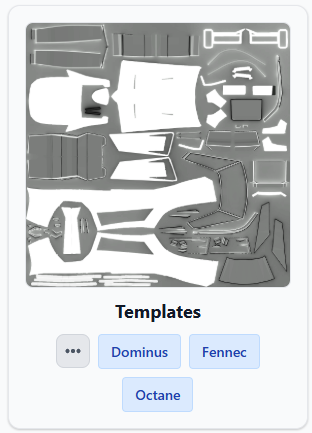

You can see the preview of the decal, the name and all the cars this decal is compatible with. For now the preview of the decal is simply the "body diffuse" of the decal, but when hovering it, you can see the 3D preview of the decal. Also hovering a Variant tag will change the preview to the one of the variant.

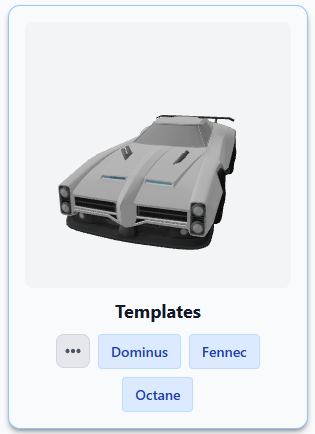

By simply clicking on a car variant, you can manage the decal for this car. You can check informations for this variant ([#Variant Info](#variant-info)), preview the model ([#Model Preview](#model-preview)), update the decal, or uninstall it.

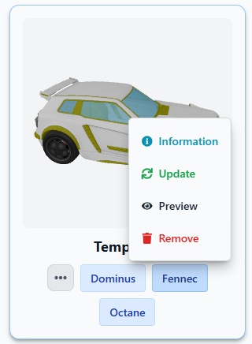

As rocket league decals are not applicable to all cars with a single decal file, this is why we have to manage decals per car variant (Except for the universal decals).

In this section you may notice that the variants buttons displayed can have two colors : either blue or purple. As blue is the default color, purple simply indicates that there is an update available for this variant, and that you should update it.

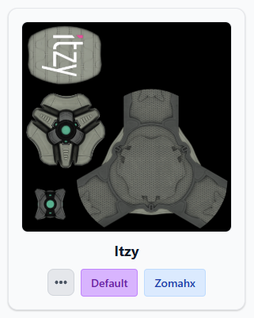

Also, you can manage all variants for this decal by simply clicking the "three dots" button on the left side.

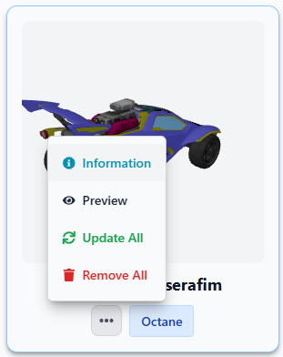

On the top left corner, you can switch between different elements, for now only "Car decals" and "Ball decals". There is also another button that enables you to update all decals that need an update.

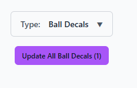

#### Explore

This section allows you to explore and discover new decals created by the community.

Here the decals are displayed in the same way as in the My Collection section, but with a little twist for the car variants. You may see three colors representing the different car variants. The blue color meaning that you don't have the decal installed, the gray color meaning that you already have the decal installed, and as for the collection page, the purple color meaning that there is an update available for this variant (and supposing you have it installed).

Here clicking on a decal you don't have installed will allow you to install it, and clicking on a decal you already have installed will allow you to update it (even if no update have been made). And as for the collection, you also can check the variant info ([#Variant Info](#variant-info)), and preview the model ([#Model Preview](#model-preview)).

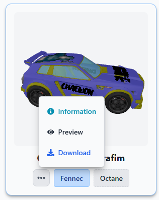
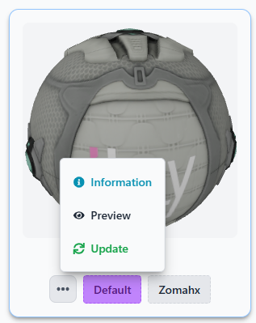

#### Variant Info

This section provides detailed information about the "Information" modal that appears when you click the "Information" button for a car variant.

In this modal, you can find various details about the selected variant, including the decal name, the variant, the list of files associated with the variant decal, the preview of the `Template.json` file (which is a file containing the information of the decal, and especially to specify how each image file is used in Alpha Console), and finally an optional `metadata.yaml` file which is a file specifically used for RL-Designer and that contains extra informations about the decal.

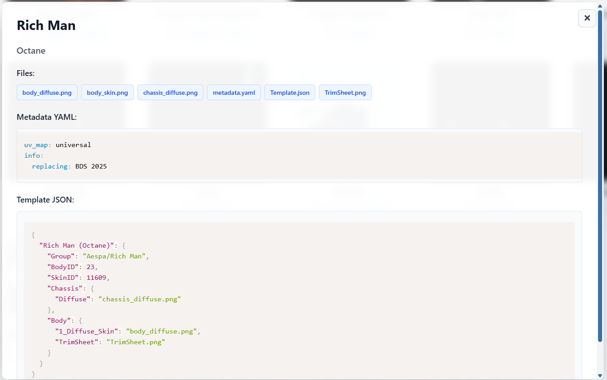

By clicking a file in the list, you are able to preview it :

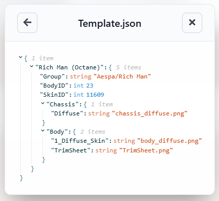
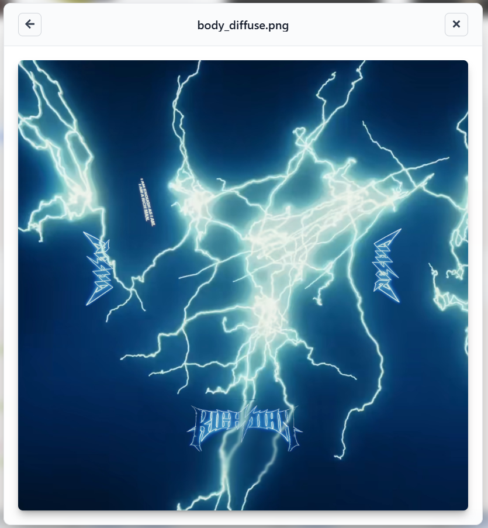

If you are not here to create decals, the `Template.json` file is not what you may be looking for, so it is not important if you don't really understand it.

However the `metadata.yaml` file can be very useful, especially for uncommon decals. Usually for regular decals, this file is not even present, but for cases like "universal" decals it contains information you need to use it properly in Rocket League. There might be a `uv_map` entry that just specifies the type of decal it is (and so the UV mapping it uses), but very importantly it also contains a `replacing` entry that indicates which decal to use in the game in order to display it. To be clear, usually to use Alpha Console decals, you must not have any decal equipped on the game or in bakkesmod, however as universal decals are only used by certain decals in the game, you have to equip this decal either directly from your inventory or in bakkesmod in order for Alpha Console to be able to display the custom "universal" decal.

In most of cases I personally use "BDS 2025" decal for those universal decals

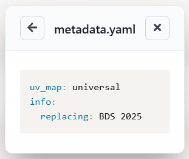

#### Model Preview

This section provides a preview of the 3D model associated with the selected decal variant. You can rotate, zoom, and pan the model to get a better view of the decal in action, and much more.

This page opens up when you click on the "Preview" button on the variant dropdown.

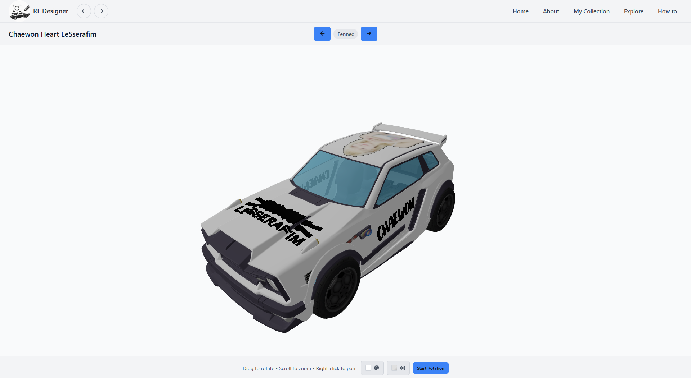

The controls are the following : 
- Rotate: Left-Click
- Zoom: Scroll Wheel
- Pan: Right-Click

On the top left of this page is displayed the decal name, and in the top center is displayed the variant name that you can switch between all available variants for this decal.

On the bottom are the settings. There is a setting to toggle automatic rotation, change colors and change material.

The change color setting allows you to change the color for different parts of the car and of the decal. You can for example change the "Main Team Color", the "Car Color", the "Secondary Color" (not implemented yet) and the "Decal Color" (the decal color corresponds to painted versions of decals (e.g. in game : Titanium White Lone Wolf)) (not implemented yet).

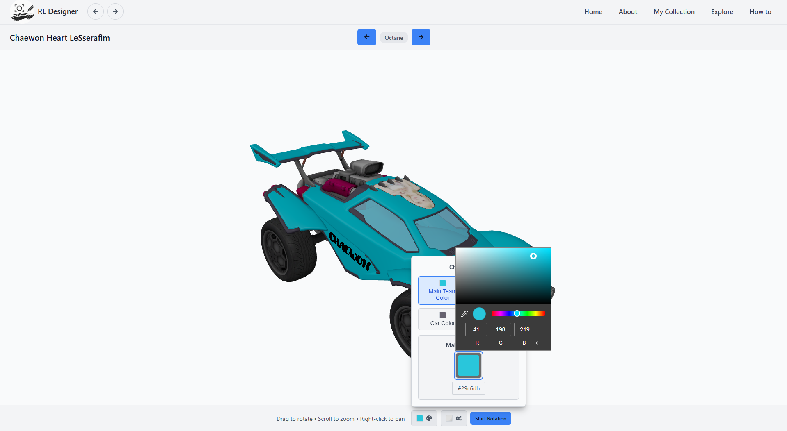

The change material setting allows you to change the material for the body part of the car.

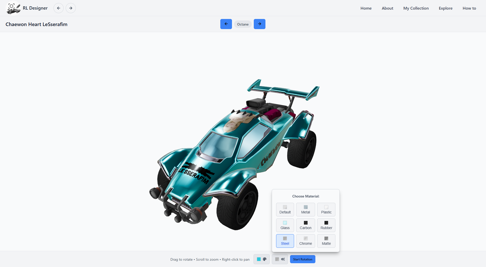

#### How To

The How To section provides tutorials and guides on how to use Rocket League Designer effectively, and this is where you are right now!
You can find detailed instructions on how to install decals, manage your collection, and explore new designs, but also how to create your own decals, and share them with the community.

#### Extra

In this section, you can find additional resources, tips, and tricks to enhance your experience.

##### Online Ball Decal Path

By default on Alpha Console, the decals on balls in online games are not allowed. Thankfully, there is a plugin, that allows you to enable decals on balls in online games. You can install this plugin directly from the app, either in the "Home" or "How To" page, in the "Requirements" section. Just click the "Install Online Ball Decal Patch" button.

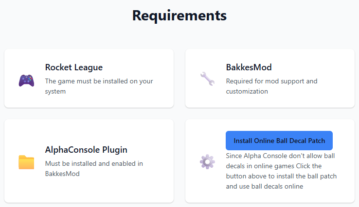