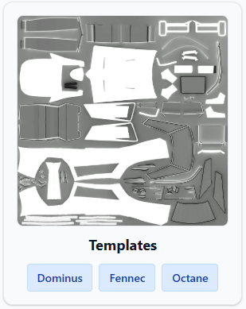
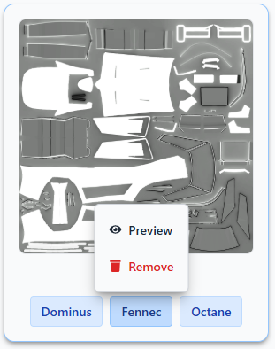
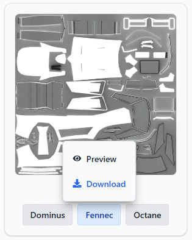
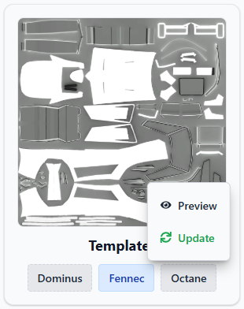

# User Guide for RL Designer

## Introduction

Rocket League Designer is a powerful tool for creating and customizing designs for Rocket League. This user guide will help you get started with the application and provide you with the information you need to make the most of its features.

## Getting Started

### Installation

1. Download the latest version of Rocket League Designer (now only provided by a shared link, but will be available on the official website soon).
2. Execute the installer and follow the on-screen instructions to install the application on your computer.
3. Once installed, launch the application from your start menu.
4. If you want to search for rl-designer in the start menu, you can type "rl-designer" to find it quickly, then click on the icon to open the application's folder, here you will find a shortcut to the application that you can copy to your desktop for easier access.

### User Interface Overview

The user interface of Rocket League Designer is designed to be intuitive and user-friendly. Here are the main components:

#### My Collection

This section displays all the decals you have currently installed in the application and that is usable in the game. You can preview (coming soon), and manage your decals here.

Your decals are displayed as follow :

You can see the preview of the decal, the name and all the cars this decal is compatible with. For now the preview of the decal is simply the "body diffuse" of the decal, but in the future we will add a more advanced preview system.

By simply clicking on a car variant, you can manage the decal for this car. For now previewing (coming soon) and deleting the decal.

As rocket league decals are not applicable to all cars with a single decal file, this is why we have to manage decals per car variant.

#### Explore

This section allows you to explore and discover new decals created by the community.

Here the decals are displayed in the same way as in the My Collection section, but with a little twist for the car variants. You may see two colors representing the different car variants. The blue color meaning that you don't have the decal installed, and the gray color meaning that you already have the decal installed.

Here clicking on a decal you don't have installed will allow you to install it, and clicking on a decal you already have installed will allow you to update it (as we don't have a precise versioning system for decals, we allow users to update decals if they want to, even if no update have been made to the decal).

#### How To

The How To section provides tutorials and guides on how to use Rocket League Designer effectively, and this is where you are right now!
You can find detailed instructions on how to install decals, manage your collection, and explore new designs, but also how to create your own decals, and share them with the community.